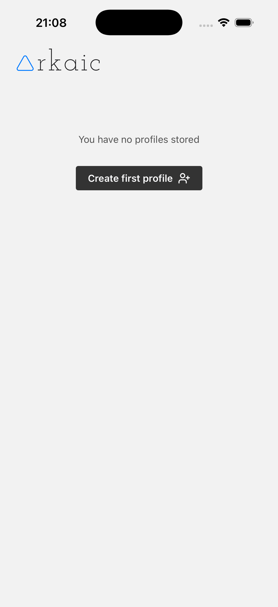
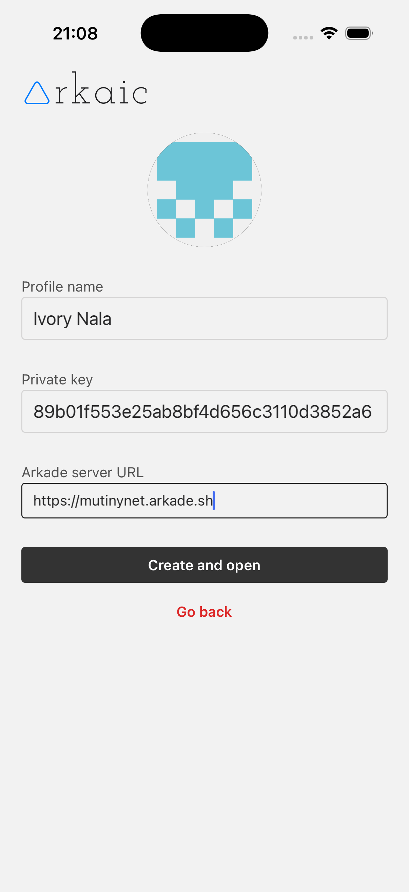
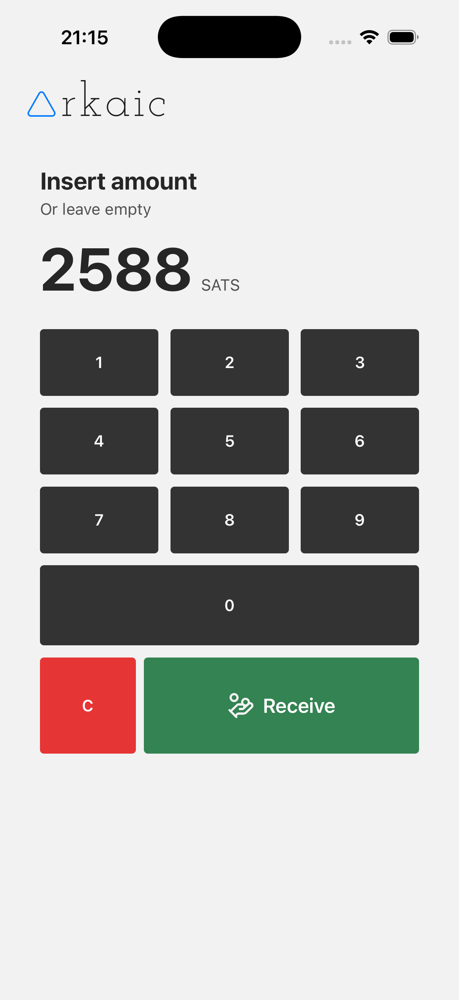
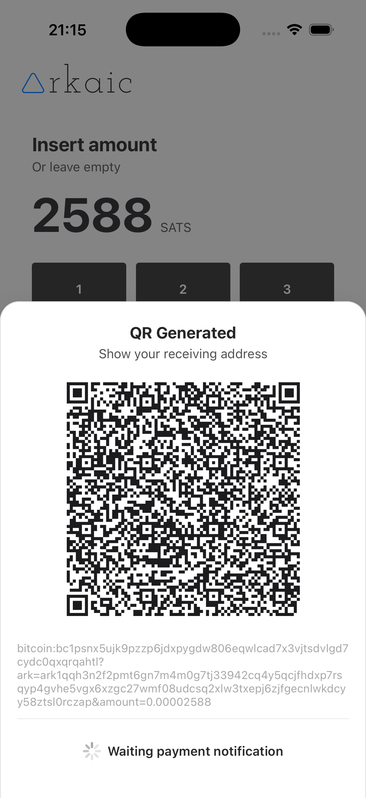
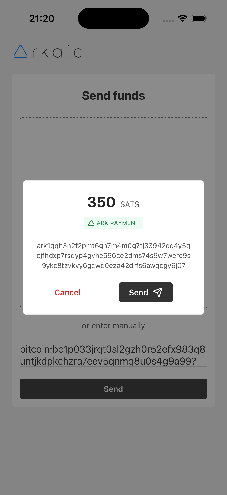
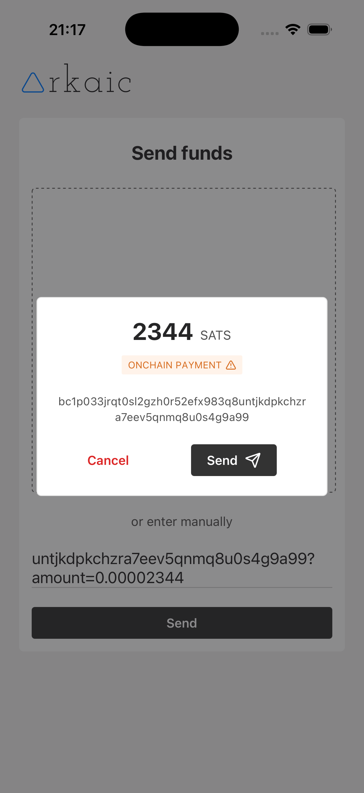
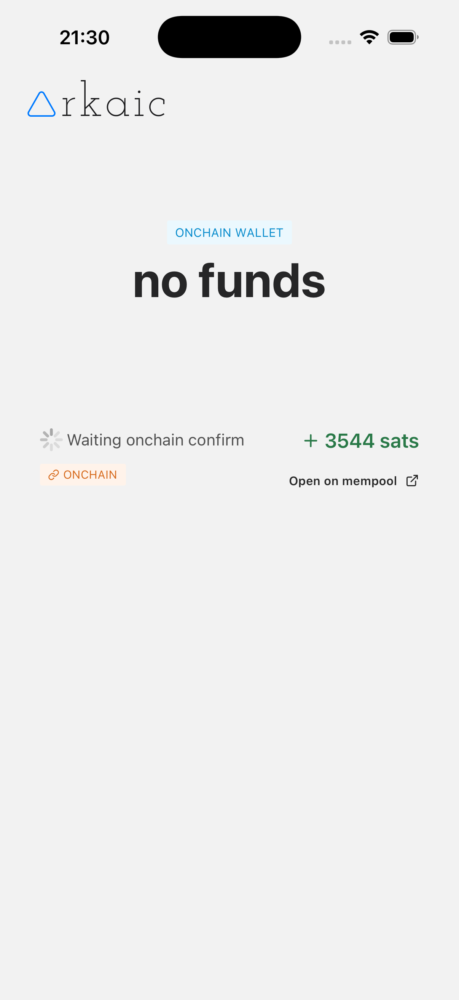
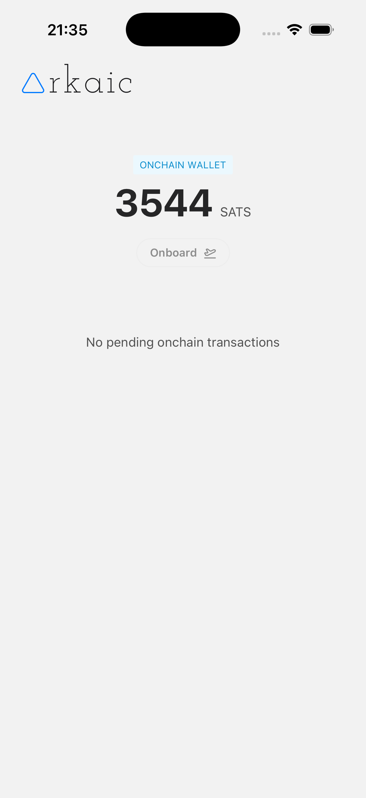

# ▲ Arkaic, the most simple bitcoin ark wallet

**Arkaic** is a mobile Bitcoin Ark wallet designed to be as simple as possible.

Built with **React Native** and **TypeScript**, Arkaic runs on both **iOS** and **Android** .

> ⚠️ **Warning** : Arkaic is **not** production-ready. There is currently **no data encryption** . Use on **mainnet at your own risk** .

> ℹ️ Arkaic uses [arkade-os/ts-sdk@v0.3.0-alpha.8](https://github.com/arkade-os/ts-sdk/tree/v0.3.0-alpha.8)

### 🧭 Getting Started

When you first open the Arkaic app, you can log in to one of the profiles you've created.

If no profiles exist, you can generate a new one.

A **profile** works like a **bank account** :

- You connect to an **ASP (Ark Service Provider)**, a mathematically trusted third party.
- A mathematically random private key is generated and stored locally on your device.

Once the profile is created or selected, you'll be redirected to the **profile dashboard** .

### 📊 Dashboard

After logging into a profile, you are taken to the **dashboard** , which acts as your main control panel.

From the dashboard, you can:

- View your total ark balance
- Switch profiles
- See your transaction history , with a clear distinction between Ark (green) and onchain (orange) transactions
- Open the Receive screen to receive a payment
- Open the Send screen to send a payment
- Access the Onchain page to manage onboarding (convert onchain funds into Ark)

### 💰 Receiving Funds

After pressing on the "receive" button, you are presented with a POS like interface. Insert the amount and press receive.

A QR Code is generated and you can scan it with any wallet that supports BIP21 address parsing.

Arkaic generates a BIP21 URI address like this:

`bitcoin:<onchain_address>?ark=<ark_address>&amount=<amount_in_btc>`

> Arkaic does not listen for onchain mempool events. An onchain payment will not be notified until confirmed on the blockchain.

### 📤 Sending Funds

You can scan a QR code with your camera or insert an address manually.

The address is then parsed using the BIP21 URI standard. If an ark value is parsed, Arkaic will send an ark payment. Otherwise an onchain transactions will be sent.

### 🏦 Ark vs Onchain: A Simple Analogy

The concepts of **Ark payment** and **onchain payment** can be compared to:

- **Instant Transfer** (Ark): fast and low-cost, happens within the same Ark Service Provider (like a transfer within the same bank)
- **Traditional Bank Transfer** (Onchain): slower and more expensive, occurs between different onchain addresses (like transferring between different banks)

Arkaic uses colored badges to distinguish an ark payment, rapresented with a green badge, and an onchain payment, rapresented with an orange badge.

### 🔄 Onboarding & Offboarding

> 📘 **Note** : To understand this section, it's useful to know what **UTXOs** and **VTXOs** are.
>
> For simplicity, think of:
>
> - **UTXOs (Unspent Transaction Outputs)** as **"gold"**
> - **VTXOs (Virtual Transaction Outputs)** as **"cash backed by gold"**

#### Onboarding: From Onchain to Ark (Gold → Cash)

If you have onchain funds (UTXOs) and want to convert them into VTXOs:

- From the dashboard go to the **"Onchain"** page
- Tap **onboard**
- All available UTXOs will be converted to VTXOs

> ⚠️ You **cannot** select a specific amount to onboard. **All UTXOs** will be converted.

#### Offboarding: From Ark to Onchain (Cash → Gold)

If you want to move your VTXOs back onchain:

- Simply make an onchain payment
- Wait for blockchain confirmation

### ✅ That’s It for Now

Arkaic is in early development. We’re keeping things simple — one step at a time.

## 🧪 Disclaimer

- Not production-ready
- No encryption implemented
- Mainnet use is **discouraged** for now

## 🚧 Dev Mode

Arkaic has **never been built for production** . You can test it in development mode using an emulator or the Expo Go app.

1. Clone the repository
2. Make sure you are using the same node engine version as declared in `.nvmrc`
3. Install packages using `yarn`
4. Run the expo project with `yarn start`

## 🙌 Donate

If you find **Arkaic** useful or want to support its development, consider making a donation.

You can send a donation to the following **onchain Bitcoin address**:

> bc1q8sv42d5afn959j8hqhn6s5l8mffzamcfr06nfk

or lightning network

> wearyjumper18@walletofsatoshi.com

## 📸 Screenshots

### Profiles

### Create profile

### Dashboard

### Receive page

### Receive page - waiting for ark payment

### Receive page - ark payment received

### Send page - ark payment (vtxo spending)

### Send page - onchain payment (swap vtxo to utxo)

### Onchain page - onchain transaactions pending

### Onchain page - confirmed onchain funds

