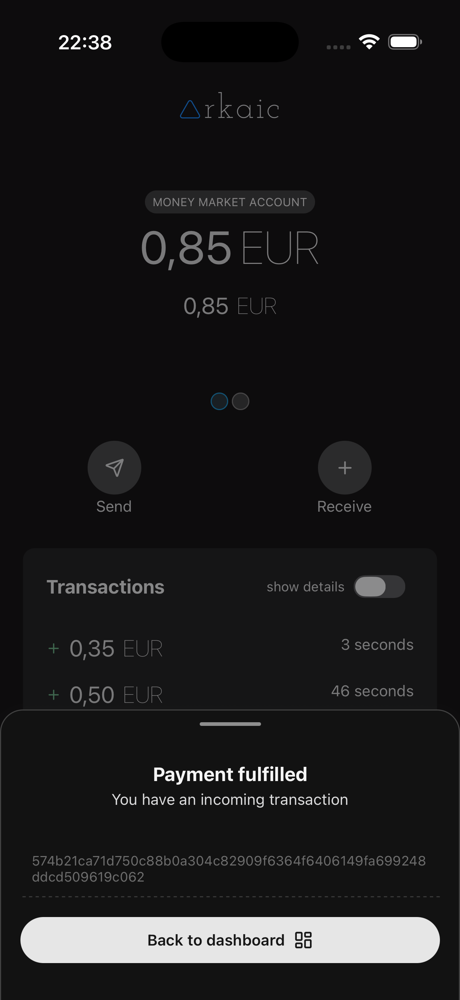

# ▲ Arkaic, the most simple bitcoin ark wallet

**Arkaic** is a mobile Bitcoin Ark wallet designed to be as simple as possible.

Built with **React Native** and **TypeScript**, Arkaic runs on both **iOS** and **Android** .

> ⚠️ **Warning** : Arkaic is **not** production-ready. There is currently **no data encryption** . Use on **mainnet at your own risk** .

> ℹ️ Arkaic uses [arkade-os/ts-sdk@v0.3.0](https://github.com/arkade-os/ts-sdk)

### 🧭 Getting Started

When you first open the Arkaic app, you will be asked to create a first account

An arkaic account works like a **bank account** :

- You connect to an **ASP (Ark Service Provider)**, a mathematically trusted third party.
- A mathematically random private key is generated and stored locally on your device.

Once the account is created, you'll be redirected to the **account dashboard** .

### 📊 Dashboard

The **dashboard** acts as your main control panel.

From the dashboard, you can:

- View your total ark balance
- Swipe between accounts
- See your transaction history
- Send and receive payments

### 💰 Receiving Funds

After pressing on the "receive" button, you are presented with a POS like interface. Insert the amount and press receive.

A QR Code is generated and you can scan it with any wallet that supports BIP21 address parsing.

Arkaic generates a BIP21 URI address like this:

`bitcoin:<onchain_address>?ark=<ark_address>&amount=<amount_in_btc>`

> For onchain payments Arkaic will give a feedback as soon as the transaction is in the mempool.

### 📤 Sending Funds

You can scan a QR code with your camera or insert an address manually.

The address is then parsed using the BIP21 URI standard. If an ark value is parsed and the signerPubkey matches our asp's signerPubkey, Arkaic will send an ark payment. Otherwise an onchain transactions will be sent.

### 🏦 Ark vs Onchain

The concepts of **Ark payment** and **onchain payment** can be compared to:

- **Instant Transfer** (Ark): fast and low-cost, happens within the same Ark Service Provider (like a transfer within the same bank)
- **Traditional Bank Transfer** (Onchain): slower and more expensive, occurs between different onchain addresses (like transferring between different banks)

Arkaic uses colored badges to distinguish an ark payment, rapresented with a green badge, and an onchain payment, rapresented with an orange badge.

### ✅ That’s It for Now

Arkaic is in early development. We’re keeping things simple — one step at a time.

## 🧪 Disclaimer

- Not production-ready
- No encryption implemented
- Mainnet use is **discouraged** for now

## 🚧 Dev Mode

Arkaic has **never been built for production** . You can test it in development mode using an emulator or the Expo Go app.

1. Clone the repository
2. Make sure you are using the same node engine version as declared in `.nvmrc`
3. Install packages using `yarn`
4. Run the expo project with `yarn start`

## 🙌 Donate

If you find **Arkaic** useful or want to support its development, consider making a donation.

You can send a donation to the following lightning network address

> littlestaff444@walletofsatoshi.com

## 📸 Screenshots

### Dashboard

### Receive action sheet

### Waiting ln swap payment

### Waiting arkaic payment

### Send action sheet

### Confirm payment

### Confirm payment

